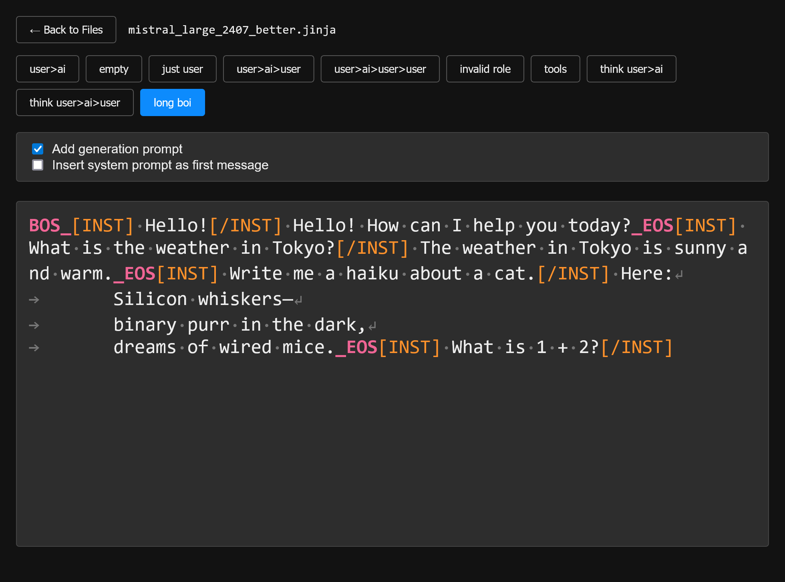

# Model Templater

A web tool to debug and test LLM model jinja chat templates.

## Screenshot



## Installation

I recommend using uv.

```bash
uv sync
```

## Usage

```bash
uv run app.py
```

Then load up your browser to the URL that flask run outputs.

### Direct Editing of Model Templates

You can directly edit a model's chat template by providing a path to the tokenizer_config.json file:

```bash
uv run app.py --config path/to/tokenizer_config.json
```

This will:
1. Extract the chat template from the config file into the templates directory
2. Automatically open the extracted template in the web interface
3. Create a backup of the original config file (with .timestamp.orig extension) before the first edit
4. Sync any changes back to the original config file in real-time

This provides a seamless way to edit a model's chat template with immediate preview of the changes.

### CLI Tool

The project includes a CLI tool for extracting and injecting chat templates from/to Hugging Face model tokenizer_config.json files.

#### Extract a chat template

```bash
uv run template_cli.py extract path/to/tokenizer_config.json
```

By default, this will extract the template to the `templates` directory with a filename based on the model name or config filename (e.g., `templates/model-name_template.jinja`). You can specify a custom output path:

```bash
uv run template_cli.py extract path/to/tokenizer_config.json --output my_template.jinja
```

#### Inject a chat template

```bash
uv run template_cli.py inject path/to/template.jinja path/to/tokenizer_config.json
```

This will update the tokenizer_config.json file with the contents of the template file.

## Features

- Renders jinja templates with a variety of test cases
- Re-renders templates when template files change
- Direct editing of Hugging Face model chat templates with two-way sync
- Automatic backup of original config files before modification
- CLI tool for extracting and injecting chat templates from/to Hugging Face model tokenizer_config.json files

## License

Model Templater is licensed under the GNU General Public License v3.0 (GPLv3). See the [LICENSE](LICENSE) file for details.
